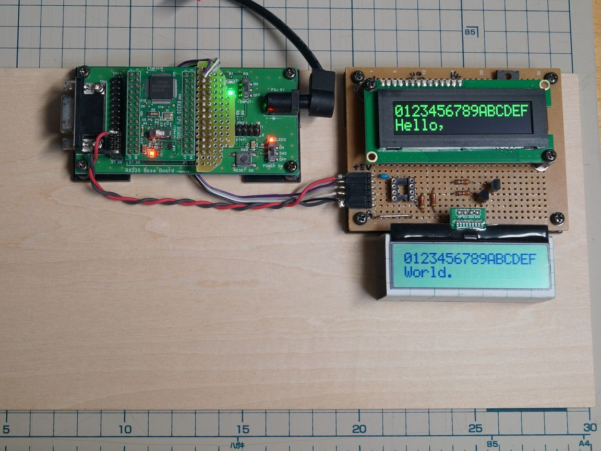
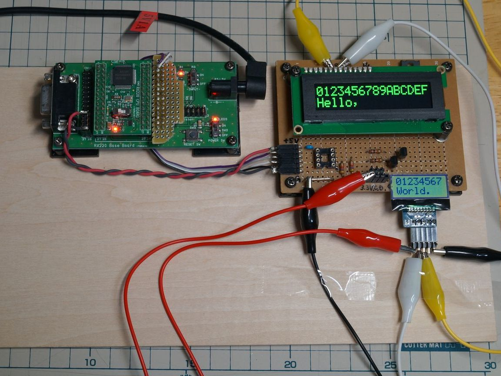
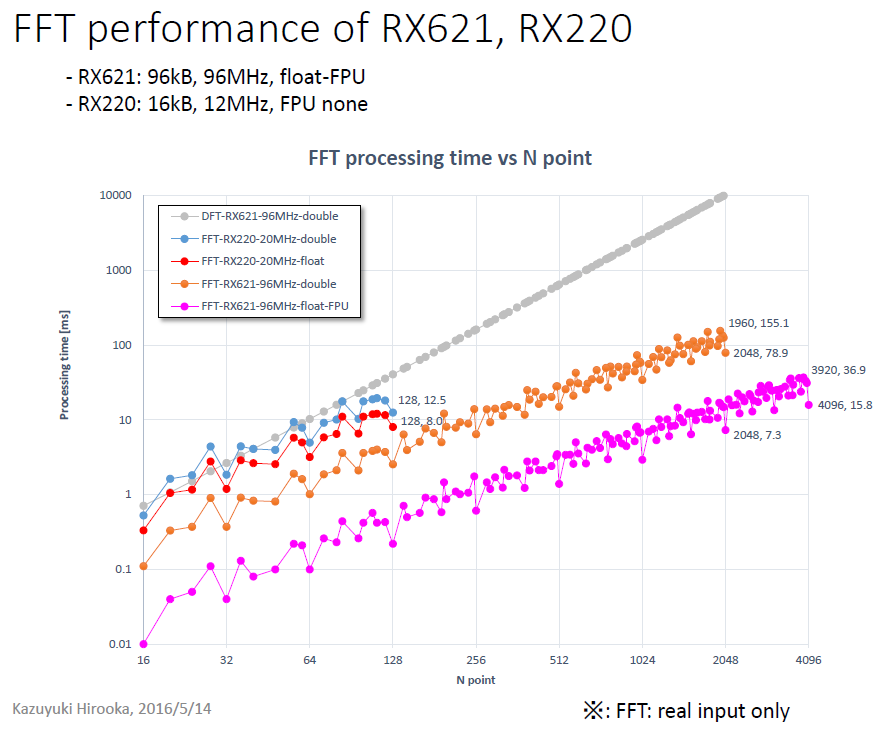

# rx220_sample
Small sample C program as a HEW project for Akizuki AE-RX220 development board
------
# 4th sample
## OLED, LCD character display unit controlled via I2C.
  
OLED 16x02: [SO1602AWGB-UC-WB-U] <http://akizukidenshi.com/catalog/g/gP-08276/>  
LCD 16x02: [AE-AQM1602A(KIT)] <http://akizukidenshi.com/catalog/g/gK-08896/>

 
  LCD replaced with 08x02 version: [SSCI-015165] <https://www.switch-science.com/catalog/1516/>

------
# 3rd sample
## DFT/FFT functions added.  
On power up, DFT and FFT functions are tested and processing time is shown via serial port.  
 - FFT function spec:  
  - Input:          real only  
  - Output:         0 to Nuquist frequency  
  - Precision:      double(8 or 4byte)  
    (Renesas tool HEW can handle double type as either 8 or 4 byte.)  
  - Number of input data supported: **N=4(2^p)(3^q)(5^r)(7^s)**  
    （4<=N<=128 and p, q, r and s is an integer >= 0）
  - Desimation type: decimation-in-time  
  - Radix:          mixed radix  
      - intermediate stage: 8, 7, 5, 4, 3, 2  
      - terminal stage:     16, 8, 5, 4, 3, 2  
  - Implementation: recursively implemented:  
        a core function calls one of radix-specific functions depending on its input data count parameter M, and the called radix-specific function calls the core function
        to perform sub-M FFT.  

  - performance summary
    
    For further details, see [20160514_FFT_performance_on_RX621_RX220.pdf](20160514_FFT_performance_on_RX621_RX220.pdf).

------
# Other functions: (the same as the 2nd sample)
- MTU2 generates 1ms signal and interrupt
- ADC converts 12 ch of analog input in scan mode
- ADC generates an interrupt on the end of scan
- Interupt handler send a char of hex for MSB 4bit of the AD value(Ch. 0)
  every 2ms
- LED1/2 on/off with 1s period
- Slide switch controls LED2

------
# License: MIT License  
- See the LICENSE.txt file for details.

-----
Blog : <http://solar-club.jp/member/radioshack16/>
-----
